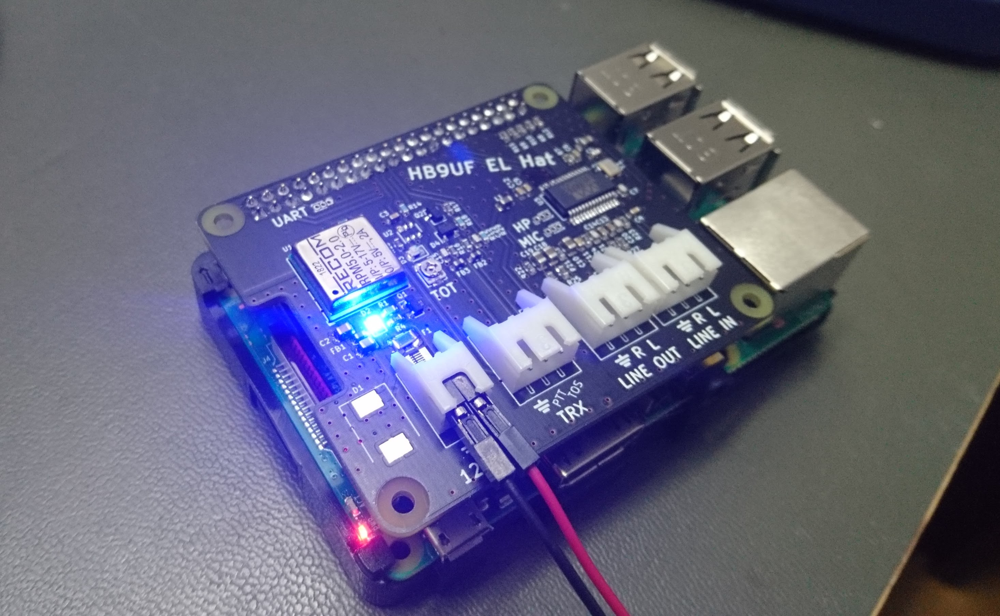
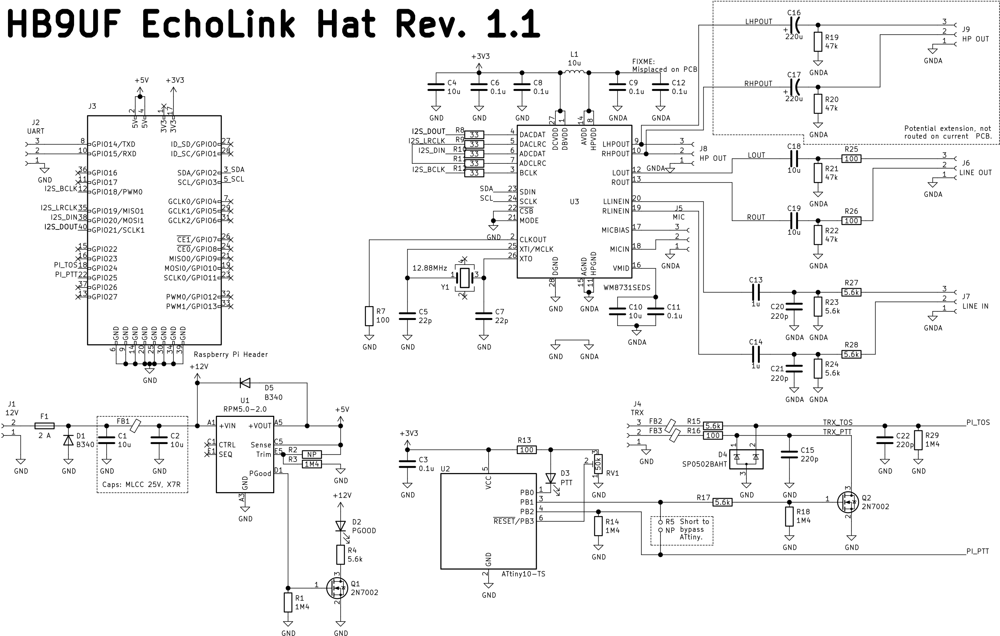
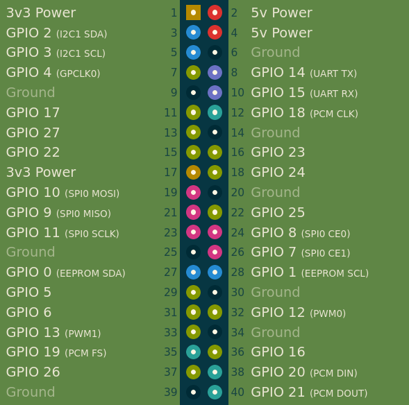

# Introduction



The HB9UF EchoLink Hat is a hat for the Raspberry Pi 3 and 4. It is designed to
connect a transceiver to a Raspberry Pi to implement a link transceiver, but
can also be used for APRS and any other application where a radio needs to be
connected to a Pi. The board features a sound card, a DC/DC converter and
some I/O circuitry to interface with the transceiver. A hardware timout-timer
is included to clear the PTT line if the Raspberry Pi asserts PTT indefinitely.

# Sound Card

The sound card is based on a [Cirrus Logic WM8731SEDS Audio CODEC](https://statics.cirrus.com/pubs/proDatasheet/WM8731_v4.9.pdf).
The line input and line output (both stereo) are routed to JST XH connectors.
The I2S bus is routed to the Raspberry Pi expansion header after
series-termination with 33 Ω. The microphone input and headphone output are
left unconnected, but a small header (1 mm pitch) is provided for prototyping.

The sound card works with a Raspbian stock image (see below).

# DC / DC Converter

Since the transceiver will be powered from an external power supply anyway,
it makes sense to derive the supply for the Pi from that same power supply.
The board is therefore equipped with a [RECOM RPM-2.0](https://recom-power.com/pdf/Innoline/RPM-2.0.pdf)
2 A DC/DC converter that can be powered from a wide range of input voltages
(3 V to 17 V). The output voltage can be trimmed with external resistors (R2
and R3). In Rev. 1.0 of the board, the voltage is slightly incrased to 5.1 V.
Rev 1.1 further increases the voltage to 5.25 V. Make sure to read the errata
below if you have Rev. 1.0. Input power is provided with a JST XH connector;
a crowbar circuit takes out the 2 A SMD fuse in a reverse polarity condition.
However, it is critical not to power the Raspberry Pi via the ordinary USB
supply when the Hat is plugged in. Starting from Rev 1.1, the Pi can be
USB-powered with the Hat inserted, but it is critical not to provide power
via the DC/DC converter and the USB power supply simultaneously.

Note that the package of the RECOM part may be difficult to solder by hand,
thus in case you decide to order PCBs from a board manufacturers, yu may
want to order a stencil from them as well.


# I/O circuitry

The PTT line is controlled with GPIO25 on the Raspberry Pi and is active
high:

```
$ echo 25 > /sys/class/gpio/export
$ cd /sys/class/gpio/gpio25
$ echo 1 > value # Assert PTT
$ echo 0 > value # Clear PTT

```

Asserting PTT activates a transistor configured in open-drain mode, thus the
PTT pin on the JST XH connector is grounded when PTT is asserted, and Hi-Z
otherwise. A 100 Ω series resistor and a diode are used for protection.

[Quasselsperre](https://github.com/HB9UF/Quasselsperre) is used to limit the
duration for which PTT can remain active. This duration is set with the
potentiometer in 15 minutes increments. Values between 15 minutes and 2 hours
can be programmed. The timer is set during startup and the LED flashes once
for each 15 minutes. (I.e. two flashes amount to a timer of 30 minutes).
The timer is only set during startup. The LED starts to blink when the timer
trips, and transmit is disabled until the Raspberry Pi clears PTT. Starting
from Rev. 1.1: In case this facility is not used, the PTT input can be
connected directly to the switching transistor by populating R5.

Please refer to the [README file](https://github.com/HB9UF/Quasselsperre/blob/master/README.md)
of our Quasselsperre project for further information on customizing,
programming etc. In case this feature is undesired, the microcontroller can
be omitted. In this case, you have to bypass the microcontroller with a jumper
bridge.

The board also features a `TOS` line to report Tone Operated Squelch or Carrier
Operated Squelch (TOS/COS) back to the Raspberry Pi. This is routed to GPIO24.
There is some amount of input protection circuitry that can be used to reduce
the voltage to 3.3 V. Remember that the Raspberry Pi is not 5 V tolerant.

# Schematic and BOM

Here is an image of the schematic. A pdf version is available in the Release
section of the github page.



An interactive BOM is available
[here for Rev 1.1](https://htmlpreview.github.io/?https://github.com/HB9UF/ElPiHat/blob/rev1.1/BOM/ibom.html),
and 
[here for Rev 1.0](https://htmlpreview.github.io/?https://github.com/HB9UF/ElPiHat/blob/rev1.0/BOM/ibom.html).
You can use it to populate the board and copy the BOM to the clipboard to order
parts from DigiKey. Note that we keep a local stock of general purpose parts,
thus we only added part numbers for specialized parts.

# Setup

To enable the sound card, add the following entries to `/boot/config.txt`
and reboot the Raspberry Pi:

```
dtparam=i2c_arm=on
dtparam=i2s=on
dtoverlay=i2s-mmap
dtoverlay=rpi-proto
```

# Test

For the first test do not solder the connector sockets to the PCB.

Here is an image of the 40pin Pi-GPIO Connector.


(1) Connect IN to 12VDC (limited to 10mA).
Measure with DMM at Pin2 on 40pin Pi-GPIO Connector: 
- There should be 5.25VDC
- Blue PGOOD/D2 LED should be constant on
- If measured voltage is lower (eg. 4.9VDC), look at R3
- If there is 0VDC, look at FB1

(2) Connect a second 3.3VDC voltage (limited to 10mA) to Pin17 on 40pin Pi-GPIO Connector:
- Red PTT/TOT/D3 LED blinks. 
Disconnect 3.3VDC voltage, change Poti position, connect 3.3VDC voltage again to Pin17.
- Red PTT/TOT/D3 LED blinks different times.
The red PTT/TOT/D3 LED blinks once per 15 minutes Quassesperre.
Threshold can be set here with this Poti.

(3) If everything OK, solder all connecors and 40pin Pi-GPIO Connector

(4) Start Pi with 12VDC via ElPiHat (1A limit) 
Caution! Do not power Pi via USB simultaneously!

(5) As soon Pi has booted:
a) Test COS/PTT functionality with GPIO
The PTT line is controlled with GPIO25 on the Raspberry Pi and is active
high:

```
$ echo 25 > /sys/class/gpio/export
$ echo out > direction
$ cd /sys/class/gpio/gpio25
$ echo 1 > value # Assert PTT
$ echo 0 > value # Clear PTT

```
Asserting PTT activates a transistor configured in open-drain mode, thus the
PTT pin on the JST XH connector is grounded when PTT is asserted, and Hi-Z
otherwise. A 100 Ω series resistor and a diode are used for protection.


b) Enable sound card by adding the following entries to `/boot/config.txt`
and reboot the Raspberry Pi:

```
dtparam=i2c_arm=on
dtparam=i2s=on
dtoverlay=i2s-mmap
dtoverlay=rpi-proto
```
c) Record and (re)play samples to test audio.

1. Start `alsamixer`, hit F6 and activate sound card 1 (`snd_rpi_proto`). Activate the `Output Mixer HiFi` item and set `CAPTURE` for the `Line` item.
2. Run `arecord -V stereo -fdat -D 'hw:CARD=sndrpiproto,DEV=0' > /dev/null` and observe the VU meter while injecting a signal into the left and the right channel. Once this works, arecord can be used to record a sample (e.g.`arecord test.wav`) for playback in the next step.
3. Play back the sample using `aplay -D 'plughw:CARD=sndrpiproto,DEV=0' test.wav`

# License

This project is released under the terms of the CC-BY-SA license. © 2020 - 2021.
